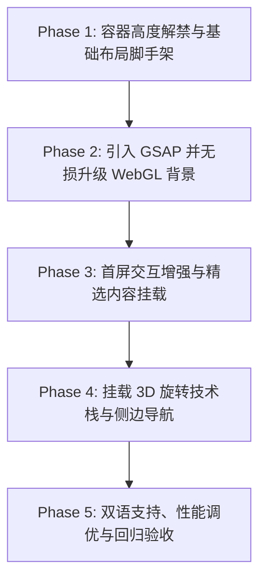

# imiles.me 首页多屏化与 3D 动画交互体验优化方案

更新时间：2026-09-11  
状态：多屏与交互已实现 / 性能预算仍待优化

---

## 1. 背景与核心目标

### 1.1 现状痛点
当前个人博客首页（`src/pages/index.astro` 及 `src/pages/zh/index.astro`）为单屏固定视口设计：
- **信息密度过低**：仅展示手写体名字、一句话介绍、格言滚动打字与底部的社交 Dock，访客无法在首屏迅速获知作者的核心技术栈、开源工程与近期深度长文。
- **内容跳转链路长**：访客必须通过顶部导航栏逐一点击跳转到 `/blog` 或 `/projects`，缺乏一站式全景概览的抓手。
- **3D 背景潜力未释放**：现有的 Three.js WebGL 粒子背景（`PlexusBackground`）被束缚在单屏视口内，滚轮无法与空间产生视差互动。

### 1.2 改造目标
- **多屏流式展厅**：打破单屏限制，以连续滚动画卷形式展示「Hero 开场 ➔ 精选工程展厅 ➔ 深度长文思考 ➔ 3D 技术雷达 ➔ 数字花园尾声」。
- **GSAP + Three.js 空间视差联动**：将底层 Three.js 画布升级为贯穿全页的连续深空漫游，随着页面滚动实现相机景深推移、粒子网络虚化聚焦，并配合 GSAP 打造高水准微交互。
- **提升触达效率**：首屏提供磁吸式直达锚点与全局快速检索（⌘K），各屏卡片展示关键信息并可一键直达详情。
- **绝对保护既有资产**：**100% 保持首屏现有的 3D WebGL 粒子连线效果、LightRays 氛围光芒、Rock Salt 手写体逐字动画与 CODEX 同步打字机制**，不降低视觉水准，不破坏既有品牌调性。
- **不采用工业标头**：不引入 `01 / 02` 这类生硬的编号，严格契合当前博客已有的**暗夜星空、人文极客与微光磨砂**美学。

---

## 2. 核心设计约束与不变量 (Invariants)

1. **首屏视觉绝对一致**：当访客刚进入页面、滚动条处于顶部（`scrollY = 0`）时，首屏的视觉呈现、字符动画入场延迟、3D 粒子初始形态、光影比例必须与改造前完全一致。
2. **渲染架构与零 JS 优先**：
   - 静态内容（项目列表、文章摘要）优先采用 **Astro 组件在服务端完成渲染**，零客户端 JS 负担。
   - 交互动效与 3D 渲染采用 **React Islands 独立隔离**（如 `client:load` / `client:visible`），不影响页面主线程可交互时间（TBT）。
3. **性能护城河**：
   - Three.js 帧循环必须具备视口感知与滚动降频能力，在进入纯长文阅读区时主动降低连线与光晕开销，保证长页面滚动帧率稳定在 60~120fps。
   - 严格继承 `useReducedMotion` 偏好，对开启减弱动效的设备自动禁用剧烈相机运镜与粒子飞驰。
4. **全链路双语同构**：
   - 英文版（`/`）与中文版（`/zh`）共享完全相同的 Section 骨架组件，文案与数据均走 `src/lib/i18n.ts` 体系。

---

## 3. 功能模块与组件架构设计

依据当前项目的目录规范（`src/components/home/`、`src/components/project/` 等），按职责单一原则进行模块化分层：

```
src/
├── pages/
│   ├── index.astro                     # 英文首页入口（组装各 Section，注入 en 数据）
│   └── zh/index.astro                  # 中文首页入口（组装各 Section，注入 zh 数据）
├── components/
│   ├── home/
│   │   ├── HomeBackgroundRig.tsx       # [React Island / client:load] 全局 Three.js + GSAP 视差控制中枢
│   │   ├── HeroSection.tsx             # [React Island / client:load] 首屏手写签名 + 磁性 CTA 按钮 + 滚动引导
│   │   ├── HomeProjectsSection.astro   # [Astro SSR] 精选工程展厅（Bento 布局，内嵌终端演示）
│   │   ├── HomeBlogSection.astro       # [Astro SSR] 深度长文思考（ShineBorder 流光磨砂卡片）
│   │   ├── HomeTechSection.tsx         # [React Island / client:visible] 3D 旋转技术栈雷达（挂载 TechSkillsCloud）
│   │   └── HomeScrollNav.tsx           # [React Island / client:idle] 右侧极简微光滚动进度与快速穿梭点
│   ├── project/
│   │   └── TerminalDemo.tsx            # [既有组件] 终端命令打字机演示
│   ├── article/
│   │   └── TechSkillsCloud.tsx         # [既有组件] 3D 旋转图标球
│   └── ui/
│       ├── plexus-background.tsx       # [既有组件] WebGL 粒子背景包装器
│       └── plexus-webgl/
│           └── PlexusScene.tsx         # [既有组件] 核心 Three.js Canvas 场景
```

### 3.1 各模块职责规范

| 模块名称 | 技术选型 | 水合策略 | 职责定义 |
|---|---|---|---|
| `HomeBackgroundRig.tsx` | React + Three.js + GSAP | `client:load` | 作为全屏底层容器（`fixed inset-0 pointer-events-none`），包裹底层的 WebGL Canvas，监听全局滚动事件驱动相机景深与粒子状态。 |
| `HeroSection.tsx` | React + Motion | `client:load` | 封装原本 `LandingExperience.tsx` 的手写字与名言机制，在此基础上扩展磁性吸附（Magnetic）CTA 胶囊与向下呼吸式滚动提示。 |
| `HomeProjectsSection.astro` | Astro 静态模板 | 零 JS (SSR) | 读取 `src/data/projects.ts`，筛选 2~3 个核心生产级项目，采用 Bento 双栏交错卡片布局，右侧挂载终端演示，提供快捷体验。 |
| `HomeBlogSection.astro` | Astro 静态模板 | 零 JS (SSR) | 通过 `getCollection('blog')` 获取最新 3~4 篇 MDX 文章，应用 `ShineBorder`，展示预估阅读时长、标签与核心摘要。 |
| `HomeTechSection.tsx` | React + Three.js | `client:visible` | 视口接近时懒加载，复用 `TechSkillsCloud.tsx`，左侧结构化呈现全栈能力矩阵，右侧呈现可拖拽的 3D 旋转技术图标球。 |
| `HomeScrollNav.tsx` | React | `client:idle` | 监听当前激活的 Section，在桌面端右侧边缘显示极细发光导航点，支持一键平滑定位。 |

---

## 4. GSAP 与 Three.js 联动交互设计

### 4.1 空间连续运镜（Camera Scroll Rig）
底层的 Three.js 画布保持 `fixed inset-0`，通过 GSAP ScrollTrigger 对 `@react-three/fiber` 的 `camera` 属性进行平滑插值，构造连续的空间漫游体验：

```typescript
// 伪代码：HomeBackgroundRig / CameraScrollRig 核心逻辑
import { useThree } from '@react-three/fiber';
import gsap from 'gsap';
import { ScrollTrigger } from 'gsap/ScrollTrigger';
import { useEffect } from 'react';

gsap.registerPlugin(ScrollTrigger);

export function CameraScrollRig({ particleUniformsRef }) {
  const { camera } = useThree();

  useEffect(() => {
    const ctx = gsap.context(() => {
      // 1. 进入 Projects 区域：相机沿 Z 轴微推并微仰，产生星系掠过的立体视差
      gsap.to(camera.position, {
        x: 1.2,
        y: -1.2,
        z: 11,
        scrollTrigger: {
          trigger: '#projects-section',
          start: 'top bottom',
          end: 'bottom top',
          scrub: 1.2,
        },
      });

      // 2. 进入 Blog 区域：相机复位拉远，粒子连线透明度平滑降至 20%，避免干扰正文阅读
      gsap.to(camera.position, {
        x: 0,
        y: 0,
        z: 18,
        scrollTrigger: {
          trigger: '#blog-section',
          start: 'top bottom',
          end: 'bottom top',
          scrub: 1.5,
        },
      });
      gsap.to(particleUniformsRef.current, {
        lineOpacity: 0.2,
        scrollTrigger: {
          trigger: '#blog-section',
          start: 'top center',
          end: 'bottom center',
          scrub: true,
        },
      });

      // 3. 进入 Tech 区域：相机微拉近，粒子引力聚焦，与前景 3D 图标球呼应
      gsap.to(camera.position, {
        z: 13,
        scrollTrigger: {
          trigger: '#tech-section',
          start: 'top bottom',
          end: 'center center',
          scrub: 1.2,
        },
      });
    });

    return () => ctx.revert();
  }, [camera]);

  return null;
}
```

### 4.2 GSAP 微交互与材质表现
1. **磁吸吸附 CTA（Magnetic Button）**：
   - 首屏按钮监听光标局部坐标，通过 `gsap.quickTo(btn, 'x', { duration: 0.4, ease: 'power3' })` 实现微弱的引力拉拽，移开后弹性回弹。
2. **卡片微距 3D 倾斜（Tilt Hover）**：
   - 鼠标滑过项目与文章卡片时，通过局部位移计算卡片的 `rotateX` 与 `rotateY`（限制在 ±3deg 之间），配合边缘 `ShineBorder` 的高光转动，制造苹果级精细硬件质感。
3. **内容卡片入场 Stagger**：
   - 滚动触发时，卡片组通过 GSAP ScrollTrigger 以错峰（`stagger: 0.1`）形式自 `y: 30, opacity: 0, filter: 'blur(8px)'` 平滑回正。

---

## 5. 逐屏视觉与信息展示规格

### 5.1 第一屏：Hero 沉浸空间
* **视觉要素**：
  - 保留既有：Plexus 3D 粒子背景 + LightRays 穿透光芒 + 手写体 `Shenshuai Ming` 逐字动画 + CODEX 格言联动打字机。
  - 新增过渡：底部添加 `mask-image: linear-gradient(to bottom, black 85%, transparent 100%)`，使粒子光晕自然溶入暗色深空。
* **交互增强**：
  - 名字与格言下方新增 2 个磁吸胶囊按钮：
    - `[ 探索工程与作品 ↓ ]`：平滑滚动到 `#projects-section`。
    - `[ 深度长文思考 ↓ ]`：平滑滚动到 `#blog-section`。
  - 屏幕正底端增加带有柔和呼吸动效的细线指示箭头与 `SCROLL TO EXPLORE`。

### 5.2 第二屏：精选工程展厅（Projects Section）
* **标头文案**：
  ```
  Craft & Architecture
  把技术转化为生产力级的产品与工具
  ```
* **展示布局**：
  - 挑选 2~3 个核心项目（如 `MTimer` 专注桌面应用等）。
  - **Bento 风格卡片**：
    - **信息区**：项目名、运行状态指示灯（`🟢 Active` / `🟡 WIP`）、一句话定位、架构亮点标签（Go, Wails, Vue3, SQLite）。
    - **交互体验区**：内嵌项目中已有的微型 `TerminalDemo`，模拟 3~4 行命令执行与输出，体现系统级工程能力。
    - **快速通道**：提供直接可点的 `Live Demo ↗` 与 `GitHub ↗`，底部带有 `查看全部项目 (N) →` 链接跳转 `/projects`。

### 5.3 第三屏：深度长文与工程思考（Blog Section）
* **标头文案**：
  ```
  Essays & Insights
  公开记录前端工程、AI 时代洞察与全栈架构思考
  ```
* **展示布局**：
  - 精选最新 3~4 篇 MDX 文章，采用双列响应式网格。
  - 卡片复用项目已有的 `ShineBorder`：平时保持微弱磨砂暗黑（`bg-neutral-900/40 backdrop-blur-md`），悬停时边缘光斑转动。
  - 卡片元数据：发布日期、阅读时长估算（`calculateReadTime`）、技术分类 Tag、2~3 行摘要。
  - 点击卡片整体直达文章正文，底部带有 `阅读更多长文 →` 链接跳转 `/blog`。

### 5.4 第四屏：技术雷达与 3D 图标球（Tech Spectrum）
* **标头文案**：
  ```
  Tech Radar & Matrix
  现代 Web 标准、系统级后端与智能体工作流
  ```
* **展示布局**：
  - **左侧**：现代工程能力矩阵分组胶囊（前端工程架构、云原生与边缘计算、AI Agent 与大模型工程）。
  - **右侧**：无缝装配现成的 **`TechSkillsCloud.tsx`** 3D 旋转图标球，支持自由拖拽旋转，鼠标悬停时高亮单个技术。

### 5.5 第五屏：数字花园尾声（Epilogue & Footer）
* 自然过渡至全站统一的 `Footer.astro`，包含 Newsletter 订阅输入框、RSS 订阅入口（`/rss.xml`）以及浮动社交栏（`SocialDock`）。

---

## 6. 渐进式实施路线图 (Phased Roadmap)

为了保证主干分支始终稳定可用、既有视觉零损坏，整个改造分为 5 个安全阶段逐步推进：



### Phase 1: 容器高度解禁与基础布局脚手架
- **目标**：打通多屏滚动的容器结构，保持现有视觉不受影响。
- **实施要点**：
  1. 检查 `src/layouts/BaseLayout.astro`，将 `fullScreen` 属性从 `index.astro` 与 `zh/index.astro` 中移除，使 `main` 容器支持纵向流动。
  2. 首屏 `Hero` 容器保持 `min-h-screen w-full`，确保进入首页时依然占据完整第一屏。
  3. 在 `src/components/home/` 下建立各个 Section 的空壳组件骨架。

### Phase 2: 引入 GSAP 并无损升级 WebGL 背景
- **目标**：接入 GSAP，将 `PlexusBackground` 升级为支持多屏视差联动的 `HomeBackgroundRig`。
- **实施要点**：
  1. 安装 `gsap`：`pnpm add gsap`。
  2. 封装 `HomeBackgroundRig.tsx`，在 `@react-three/fiber` 内部通过 GSAP ScrollTrigger 绑定相机与粒子材质，在 `scrollY = 0` 时保持所有参数与旧场景 100% 一致。
  3. 引入视口检测机制：进入文字阅读区自动降频背景渲染，保护滚动 FPS。

### Phase 3: 首屏交互增强与精选内容挂载
- **目标**：落地第二屏（项目）与第三屏（博客），解决“信息少、跳转繁琐”的核心痛点。
- **实施要点**：
  1. 在 `HeroSection.tsx` 中加入磁吸式平滑滚动按钮（锚向 `#projects-section`、`#blog-section`）与呼吸下划线。
  2. 编写 `HomeProjectsSection.astro`，接入 `src/data/projects.ts` 与 `TerminalDemo`。
  3. 编写 `HomeBlogSection.astro`，接入 `getCollection('blog')`、`calculateReadTime` 与 `ShineBorder`。

### Phase 4: 挂载 3D 旋转技术栈与侧边导航
- **目标**：连接第四屏技术雷达，强化交互沉浸感。
- **实施要点**：
  1. 编写 `HomeTechSection.tsx`，将既有的 `TechSkillsCloud.tsx` 与左侧能力矩阵组合。
  2. 编写 `HomeScrollNav.tsx`，在屏幕右侧提供极简的点状章节吸附导航器。

### Phase 5: 双语适配、性能基线核验与验收
- **目标**：多语言完整覆盖与工程质量保障。
- **实施要点**：
  1. 补充 `src/locales/en.ts` 与 `src/locales/zh.ts` 中的首页新增文案键名。
  2. 运行 `pnpm lint:fix` 与 `pnpm format:check`，确保 Biome 校验 100% 通过。
  3. 运行 `pnpm build` 与 `pnpm perf:budget`，检查打包体积与首屏性能，确保不引入额外长任务阻塞。

---

## 7. 风险评估与应对预案

| 潜在风险点 | 影响评估 | 应对预案 |
|---|---|---|
| **首屏 LCP / TBT 劣化** | 引入 GSAP 后首屏 JS 资源增加，可能拉低性能基线。 | 1. 静态内容（项目/博客）使用 Astro SSR 原生 HTML 渲染，零客户端 JS。<br>2. GSAP 与 ScrollTrigger 采用动态 `import('gsap')` 懒加载，确保不阻塞首屏手写字体与 WebGL 初始化。 |
| **移动端滚动掉帧 / 发热** | 手机端同时运行 Three.js 与多屏滚动可能导致 GPU 压力过大。 | 1. 继承既有的 `tier === 'mobile'` 降级策略（粒子数从 800 降至 250）。<br>2. 手机端进入第二屏后，直接将 WebGL 画布暂停渲染（`frameloop="demand"`）。 |
| **首屏 3D 动画与旧版产生细微视觉差异** | 用户已有的手写体、粒子形态若被篡改会破坏品牌认同。 | 在改造前后通过截图对比首屏像素与字符进入时序，确保初始参数（FOV、粒子分布、光影色温）绝对一致。 |
| **双语路由切换锚点失效** | 英文（`/`）与中文（`/zh`）切换时锚点定位可能出现偏斜。 | 所有锚点统一采用语义化 ID（如 `#projects`、`#articles`、`#tech`），并在多语言切换时仅重定向路径前缀，保留 hash 状态。 |


## 8. 实施记录（2026-09-12）

- `/` 与 `/zh` 统一使用 `HomePage.astro`，依次展示首屏、工程、文章、技术雷达、数字花园，移除首页 `fullScreen` 与重复的 `main`。
- 首屏沿用手写字动画、CODEX 回调、粒子数量和相机初始参数。新增独立定位的锚点按钮；短视口允许首屏增长，防止按钮、格言和 Dock 相互遮挡。
- 根据本次背景要求，后续各屏使用一层连续的 LightRays。粒子画布局限于首屏，离屏及标签页隐藏时暂停；没有采用全页 Three.js 相机漫游。
- 磁吸按钮、卡片轻微倾斜与错峰入场复用已安装的 Motion，通过 IntersectionObserver 触发，没有额外引入 GSAP。关闭动效时保持静态内容和原生锚点可用。
- 工程数据目前只有 MTimer，展示实际截图、两项功能、技术栈与真实链接。为终端类型项目保留 `TerminalDemo` 分支，不虚构其他项目或终端输出。
- 文章按语言筛选、排除草稿、按时间倒序显示最多四篇。卡片和 ShineBorder 服务端渲染，不进行 React 水合。
- 技术球支持内嵌模式、触摸拖拽、暂停和离屏停止。正文中的原弹窗模式保留。
- 章节导航支持当前章节提示；⌘K / Ctrl K 搜索文章、故事、项目与主要栏目；使用原生 dialog 提供焦点约束和 Esc 关闭，打开时聚焦输入框。
- 尾屏提供 RSS、关于链接及 SocialDock。仅在配置 `PUBLIC_BUTTONDOWN_USERNAME` 时显示有效邮件订阅表单，避免提交到未配置的服务。
- 语言切换保留锚点。LightRays 在减弱动效时保留静态光晕，并在离屏、隐藏标签页时停止光束动画。

### 验证与限制

- `pnpm build` 通过；修改范围内 Biome 检查通过。
- 浏览器核验中文 1440px 桌面与 390px 移动端：五个章节、原生链接、项目图片、响应式技术球正常，无横向溢出；首屏按钮与签名、格言不重叠。
- 英文浅色模式验证通过：Ctrl K 打开并聚焦搜索，MTimer 查询只返回匹配项目，文章章节导航状态正确；首页内容区站内链接均返回 HTTP 200。
- 完整仓库 lint / format 检查仍存在修改范围外的问题（包括 `.vscode/settings.json` 与 `floating-3d-particles.tsx`）；TypeScript 全仓检查仍有 PDF 模块的既有错误。
- 性能脚本中 Hero 约 13.8 KiB，低于 24 KiB 预算；整体 CSS 约 143.8 KiB，高于 130 KiB 预算。未上调预算，也未将静态体积检查描述为 FPS / Core Web Vitals 验收。
- 首屏保留参数已核对，但没有改造前后同一随机粒子种子的像素级截图基线，不能宣称逐像素一致。

### 工程屏轮播更新

工程展示已替换为独立的 `ExpandingCarousel`，参考 Calendly Customer Stories 的中央展开、两侧收窄、连接形状与进度指示器交互。首页把 MTimer 现有六张截图映射为六个真实功能视图；明暗主题与 LightRays 保留。组件 API 和差异说明见 [expanding-carousel.md](./expanding-carousel.md)。
